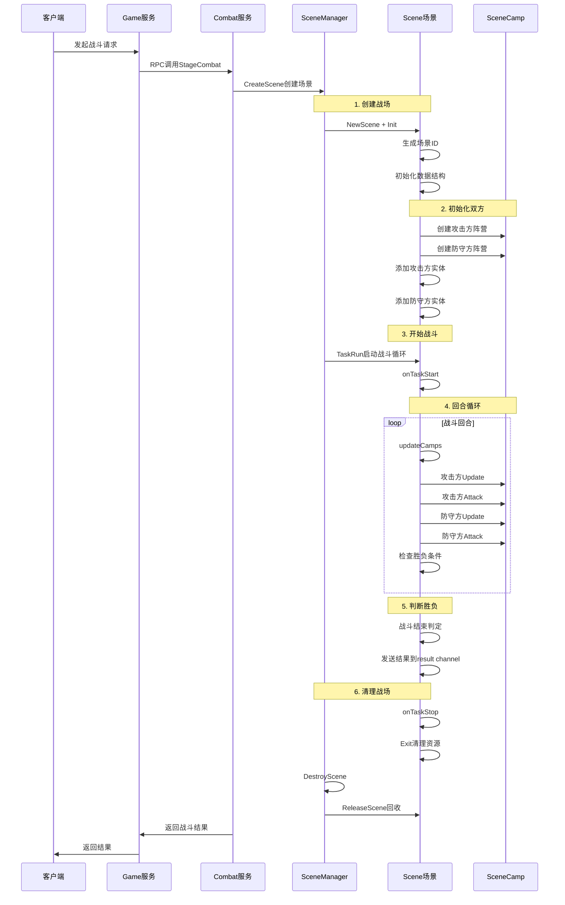

# 战斗场景生命周期详细实现

## 概述

本文档详细分析战斗场景从创建到销毁的完整生命周期，包括数据结构、代码实现和主要方法的具体过程。

## 1. 生命周期概览



## 2. 第一阶段：创建战场

### 2.1 SceneManager创建场景

```go
// SceneManager.CreateScene - 场景创建入口
func (m *SceneManager) CreateScene(ctx context.Context, opts ...SceneOption) (*Scene, error) {
    // 1. 检查场景数量限制
    m.RLock()
    sceneNum := len(m.mapScenes)
    m.RUnlock()
    if sceneNum >= define.Scene_MaxNumPerCombat {
        return nil, ErrSceneNumLimit  // 最大场景数限制
    }

    // 2. 创建场景实例
    s, err := m.createEntryScene(opts...)
    if err != nil {
        return nil, err
    }

    // 3. 注册到场景管理器
    m.Lock()
    m.mapScenes[s.GetId()] = s
    m.Unlock()

    // 4. 启动场景任务循环
    m.wg.Wrap(func() {
        defer utils.CaptureException()

        for {
            err := s.TaskRun(ctx)
            _ = utils.ErrCheck(err, "scene.Run failed", s.GetId())

            // 任务异常时重启，其他错误退出
            if errors.Is(err, task.ErrTaskPanic) {
                continue
            } else {
                break
            }
        }

        // 战斗结束，清理场景
        s.Exit(ctx)
        m.DestroyScene(s)
    })

    log.Info().Int64("scene_id", s.GetId()).Msg("create a new scene")
    return s, nil
}
```

### 2.2 场景基础数据结构

```go
type Scene struct {
    opts   *SceneOptions           // 场景配置选项
    tasker *task.Tasker           // 任务处理器

    // 基础标识
    id          int64             // 场景唯一ID（雪花算法生成）
    entityIdGen int64             // 实体ID生成器

    // 战斗数据
    entityMap   *treemap.Map      // 战斗实体映射 map[entityId]*SceneEntity
    curRound    int32             // 当前回合数
    maxRound    int32             // 最大回合数
    result      chan bool         // 战斗结果通道
    rand        *random.FakeRandom[int] // 场景专用随机数生成器

    // 阵营管理
    camps       [define.Scene_Camp_End]*SceneCamp // 双方阵营

    // 技能和状态
    comFinishList *list.List      // ATB条结束的实体列表
    spellList     *list.List      // 场景内技能列表

    wg utils.WaitGroupWrapper     // 协程管理
    sync.RWMutex                  // 读写锁
}
```

### 2.3 场景初始化过程

```go
func (s *Scene) Init(sceneId int64, opts ...SceneOption) *Scene {
    // 1. 基础数据初始化
    s.id = sceneId
    s.entityMap = treemap.NewWith(god_utils.Int64Comparator)
    s.comFinishList = list.New()
    s.spellList = list.New()
    s.result = make(chan bool, 1)
    s.opts = DefaultSceneOptions()
    
    // 2. 随机数生成器初始化（使用当前时间作为种子）
    s.rand = random.NewFakeRandom(int(time.Now().Unix()))
    
    // 3. 任务处理器初始化
    s.tasker = task.NewTasker()

    // 4. 创建双方阵营
    for n := define.Scene_Camp_Begin; n < define.Scene_Camp_End; n++ {
        s.camps[n] = NewSceneCamp(s, n)
    }

    // 5. 应用场景配置选项
    for _, o := range opts {
        o(s.opts)
    }

    return s
}
```

## 3. 第二阶段：初始化双方

### 3.1 阵营数据结构

```go
type SceneCamp struct {
    scene        *Scene           // 所属场景
    actionIdx    int              // 当前行动单位索引
    camp         int32            // 阵营标识（攻击方/防守方）
    aliveUnitNum int32            // 存活单位数量
    
    // 玩家信息
    playerId     int64            // 所属玩家ID
    playerLevel  int32            // 玩家等级
    playerScore  int64            // 玩家战力
    playerName   string           // 玩家名字
    serverName   string           // 服务器名字
    guildName    string           // 工会名字
    guildId      int64            // 工会ID
    portrait     int32            // 玩家头像ID

    // 阵营技能
    energy  int32                 // 符文能量
    spellCd []int                 // 技能冷却时间
}
```

### 3.2 添加攻击方实体

```go
// 添加攻击方实体（玩家角色）
for _, unitInfo := range s.opts.AttackEntityList {
    err := s.AddEntityByPB(s.camps[define.Scene_Camp_Attack], unitInfo)
    utils.ErrPrint(err, "AddEntityByPB failed when Scene.Init", sceneId, s.opts.SceneEntry.Id, unitInfo.HeroTypeId)
}

func (s *Scene) AddEntityByPB(camp *SceneCamp, unitInfo *pbGlobal.EntityInfo) error {
    // 1. 获取英雄配置
    entry, ok := auto.GetHeroEntry(unitInfo.HeroTypeId)
    if !ok {
        return fmt.Errorf("GetUnitEntry failed: type_id<%d>", unitInfo.HeroTypeId)
    }

    // 2. 获取模型配置
    modelEntry, ok := auto.GetModelEntry(entry.ModelID)
    if !ok {
        return fmt.Errorf("err:<%w>, model_id:<%d>", ErrSceneModelNotFound, entry.ModelID)
    }

    // 3. 生成实体ID
    id := atomic.AddInt64(&s.entityIdGen, 1)
    
    // 4. 创建场景实体
    e, err := NewSceneEntity(
        s,
        id,
        WithEntityHeroId(unitInfo.HeroTypeId),
        WithEntityAttList(unitInfo.AttValue),
        WithEntityHeroEntry(entry),
        WithEntityModelEntry(modelEntry),
    )

    if err != nil {
        return err
    }

    // 5. 添加到场景实体映射
    s.entityMap.Put(id, e)
    return nil
}
```

### 3.3 添加防守方实体

```go
// 添加防守方实体（怪物）
battleWaveEntry := s.opts.BattleWaveEntries[0]
if battleWaveEntry != nil {
    for idx := range battleWaveEntry.MonsterID {
        // 跳过无效怪物ID
        if battleWaveEntry.MonsterID[idx] == -1 {
            continue
        }

        // 获取怪物配置
        monsterEntry, ok := auto.GetMonsterEntry(battleWaveEntry.MonsterID[idx])
        if !ok {
            continue
        }

        // 创建怪物实体
        err := s.AddEntityByOptions(
            s.camps[define.Scene_Camp_Defence],
            WithEntityMonsterId(battleWaveEntry.MonsterID[idx]),
            WithEntityMonsterEntry(monsterEntry),
            WithEntityPosition(battleWaveEntry.PositionX[idx], battleWaveEntry.PositionZ[idx], battleWaveEntry.Rotation[idx]),
            WithEntityInitAtbValue(battleWaveEntry.InitalCom[idx]),
        )

        _ = utils.ErrCheck(err, "AddEntityByOptions failed when Scene.Init", battleWaveEntry.MonsterID[idx])
    }
}
```

## 4. 第三阶段：开始战斗

### 4.1 任务处理器配置

```go
// 配置任务处理器的生命周期回调
s.tasker.Init(
    task.WithStartFns(func() {
        s.onTaskStart()  // 战斗开始回调
    }),

    task.WithStopFns(func() {
        s.onTaskStop()   // 战斗结束回调
    }),

    task.WithUpdateFn(func() {
        s.onTaskUpdate() // 每帧更新回调
    }),
)
```

### 4.2 战斗开始处理

```go
func (s *Scene) onTaskStart() {
    // 通知所有实体战斗开始
    it := s.entityMap.Iterator()
    for it.Next() {
        it.Value().(*SceneEntity).OnSceneStart()
    }
}

func (s *Scene) TaskRun(ctx context.Context) error {
    return s.tasker.Run(ctx)  // 启动任务处理器
}
```

### 4.3 每帧更新处理

```go
func (s *Scene) onTaskUpdate() {
    s.updateEntities()  // 更新所有实体
    s.updateCamps()     // 更新阵营战斗逻辑
}

func (s *Scene) updateEntities() {
    // 更新所有战斗实体
    it := s.entityMap.Iterator()
    for it.Next() {
        it.Value().(*SceneEntity).Update()
    }
}
```

## 5. 第四阶段：回合循环

### 5.1 阵营更新主循环

```go
func (s *Scene) updateCamps() {
    // 是否攻击方先手
    bAttackFirst := true

    // 回合循环
    for ; s.curRound+1 <= s.maxRound; s.curRound++ {
        bEnterNextRound := false
        nActionRount := 0
        
        // 单回合内的行动循环
        for !bEnterNextRound {
            nActionRount++

            if bAttackFirst {
                // 攻击方行动
                s.camps[int(define.Scene_Camp_Attack)].Update()
                if !s.camps[int(define.Scene_Camp_Attack)].IsLoopEnd() {
                    s.camps[int(define.Scene_Camp_Attack)].Attack(s.camps[int(define.Scene_Camp_Defence)])
                }

                // 防守方行动
                s.camps[int(define.Scene_Camp_Defence)].Update()
                if !s.camps[int(define.Scene_Camp_Defence)].IsLoopEnd() {
                    s.camps[int(define.Scene_Camp_Defence)].Attack(s.camps[int(define.Scene_Camp_Attack)])
                }
            } else {
                // 防守方先手的情况（类似逻辑）
                // ...
            }

            // 检查是否进入下一回合
            if s.camps[int(define.Scene_Camp_Attack)].IsLoopEnd() &&
               s.camps[int(define.Scene_Camp_Defence)].IsLoopEnd() {
                
                // 补充剩余行动
                for i := nActionRount; i < Camp_Max_Unit; i++ {
                    s.camps[int(define.Scene_Camp_Defence)].Update()
                    s.camps[int(define.Scene_Camp_Attack)].Update()
                }

                nActionRount = 0
                bEnterNextRound = true
            }
        }

        // 重置行动索引
        s.camps[int(define.Scene_Camp_Attack)].ResetLoopIndex()
        s.camps[int(define.Scene_Camp_Defence)].ResetLoopIndex()

        // 检查战斗结束条件
        if !s.camps[int(define.Scene_Camp_Attack)].IsValid() ||
           !s.camps[int(define.Scene_Camp_Defence)].IsValid() {
            break  // 有一方全灭，战斗结束
        }
    }
}
```

### 5.2 阵营行动逻辑

```go
// 阵营更新
func (c *SceneCamp) Update() {
    // 更新阵营状态、技能冷却等
}

// 阵营攻击
func (c *SceneCamp) Attack(dst *SceneCamp) {
    // 当前实现被注释，预留攻击逻辑
    // 实际攻击逻辑在SceneEntity层面实现
}

// 检查行动是否结束
func (c *SceneCamp) IsLoopEnd() bool {
    return c.actionIdx >= Camp_Max_Unit
}

// 重置行动索引
func (c *SceneCamp) ResetLoopIndex() {
    c.actionIdx = 0
}

// 检查阵营是否有效（是否还有存活单位）
func (c *SceneCamp) IsValid() bool {
    return c.aliveUnitNum != 0
}
```

## 6. 第五阶段：判断胜负

### 6.1 胜负判定条件

```go
// 战斗结束条件检查
if !s.camps[int(define.Scene_Camp_Attack)].IsValid() ||
   !s.camps[int(define.Scene_Camp_Defence)].IsValid() {
    break  // 有一方全灭，战斗结束
}

// 达到最大回合数也会结束战斗
if s.curRound >= s.maxRound {
    break
}
```

### 6.2 结果通知

```go
// 获取战斗结果
func (s *Scene) GetResult() bool {
    return <-s.result  // 从结果通道读取战斗结果
}

// 发送战斗结果（在战斗逻辑中调用）
func (s *Scene) sendResult(attackWin bool) {
    select {
    case s.result <- attackWin:
        // 结果发送成功
    default:
        // 通道已满或已关闭
    }
}
```

## 7. 第六阶段：清理战场

### 7.1 战斗结束处理

```go
func (s *Scene) onTaskStop() {
    log.Info().
        Int32("scene_type_id", s.opts.SceneEntry.Id).
        Int64("scene_id", s.GetId()).
        Msg("scene context done...")
}

func (s *Scene) Exit(ctx context.Context) {
    s.wg.Wait()  // 等待所有协程结束
}
```

### 7.2 场景销毁

```go
func (m *SceneManager) DestroyScene(s *Scene) {
    m.Lock()
    defer m.Unlock()

    // 从场景管理器中移除
    delete(m.mapScenes, s.id)
    
    // 回收场景对象
    ReleaseScene(s)
}
```

### 7.3 资源清理

```go
func (s *Scene) ClearEntities() {
    s.entityMap.Clear()  // 清理所有实体
}

// 对象池回收（假设实现）
func ReleaseScene(s *Scene) {
    // 重置场景状态
    s.id = 0
    s.entityIdGen = 0
    s.curRound = 0
    s.maxRound = 0
    
    // 清理数据结构
    s.entityMap.Clear()
    s.comFinishList.Init()
    s.spellList.Init()
    
    // 关闭通道
    close(s.result)
    
    // 放回对象池
    scenePool.Put(s)
}
```

## 8. 关键数据流转

### 8.1 场景ID生成

```go
// 使用雪花算法生成唯一场景ID
sceneId, err := utils.NextID(define.SnowFlake_Scene)
```

### 8.2 实体ID生成

```go
// 场景内实体ID自增生成
id := atomic.AddInt64(&s.entityIdGen, 1)
```

### 8.3 随机数管理

```go
// 场景专用随机数生成器，确保战斗可重现
s.rand = random.NewFakeRandom(int(time.Now().Unix()))

// 使用场景随机数
hitChance := s.Rand(1, 100)
```

## 9. 性能优化要点

### 9.1 并发安全

- 使用读写锁保护场景映射
- 原子操作生成实体ID
- 协程安全的任务处理

### 9.2 内存管理

- 对象池回收场景实例
- 及时清理实体映射
- 控制最大场景数量

### 9.3 错误处理

- 任务异常时自动重启
- 优雅的资源清理
- 完整的错误日志

这个生命周期设计确保了战斗场景的稳定运行和资源的有效管理，支持高并发的战斗需求。
