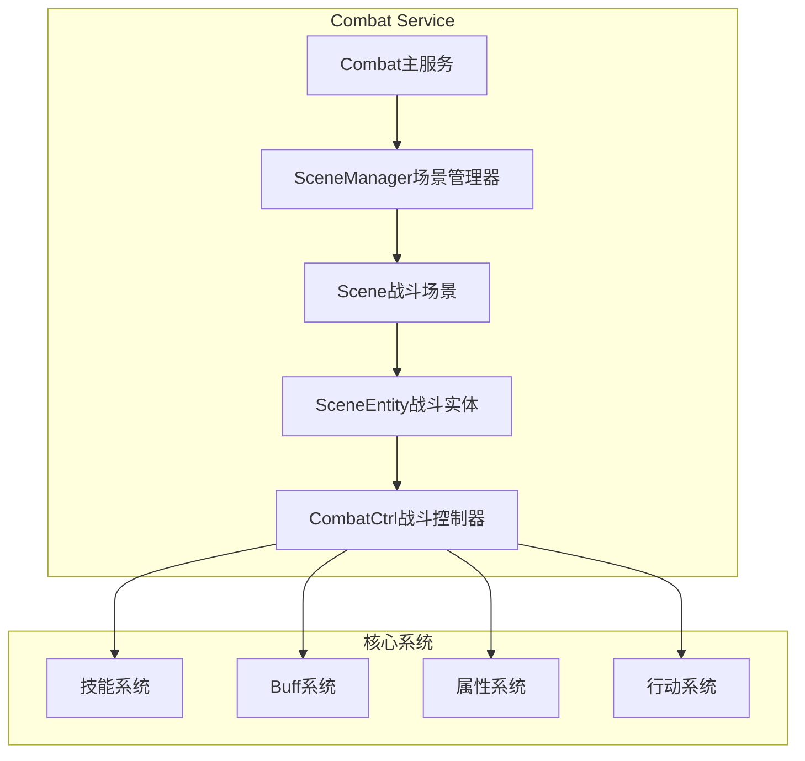
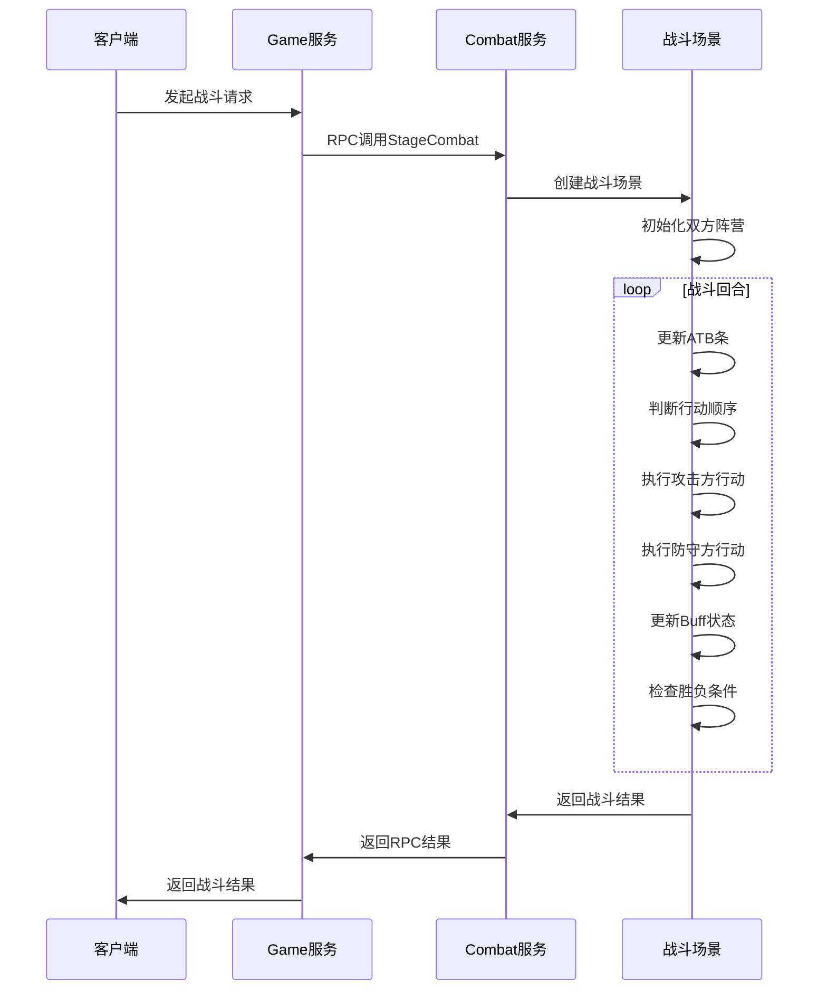

# 战斗服务业务逻辑设计详解

## 概述

战斗服务是游戏服务器的核心模块之一，负责处理所有战斗相关的业务逻辑。本文档详细介绍战斗服务的架构设计、核心系统实现和业务流程。

## 1. 整体架构设计

### 1.1 服务架构



### 1.2 核心组件

```go
type Combat struct {
    app                *cli.App               
    ID                 int16                  // 战斗服务ID
    SnowflakeStartTime int64                  
    wg                 utils.WaitGroupWrapper 

    gin        *GinServer             // HTTP服务器
    mi         *MicroService          // 微服务框架
    sm         *scene.SceneManager    // 场景管理器
    rpcHandler *RpcHandler            // RPC处理器
    pubSub     *PubSub                // 发布订阅
    cons       *consistent.Consistent // 一致性哈希
}
```

**组件说明**：
- **SceneManager**: 管理所有战斗场景的生命周期
- **RpcHandler**: 处理来自Game服务的战斗请求
- **PubSub**: 处理战斗相关的事件发布订阅
- **一致性哈希**: 用于战斗场景的负载均衡

## 2. 场景管理系统

### 2.1 场景数据结构

```go
type Scene struct {
    opts   *SceneOptions
    tasker *task.Tasker    // 任务处理器

    id          int64
    entityIdGen int64
    entityMap   *treemap.Map // 战斗unit列表
    curRound    int32        // 当前回合
    maxRound    int32        // 最大回合
    result      chan bool    // 战斗结果
    rand        *random.FakeRandom[int] // 随机数生成器
    camps       [define.Scene_Camp_End]*SceneCamp // 阵营

    comFinishList *list.List // com条结束的entity列表
    spellList     *list.List // 场景内技能列表
}
```

### 2.2 战斗流程控制

```go
// 战斗主循环
if bAttackFirst {
    s.camps[int(define.Scene_Camp_Attack)].Update()
    
    // 本轮攻击没有结束
    if !s.camps[int(define.Scene_Camp_Attack)].IsLoopEnd() {
        s.camps[int(define.Scene_Camp_Attack)].Attack(s.camps[int(define.Scene_Camp_Defence)])
    }

    s.camps[int(define.Scene_Camp_Defence)].Update()
    
    // 本轮攻击没有结束
    if !s.camps[int(define.Scene_Camp_Defence)].IsLoopEnd() {
        s.camps[int(define.Scene_Camp_Defence)].Attack(s.camps[int(define.Scene_Camp_Attack)])
    }
}
```

**流程特点**：
- **回合制战斗**: 基于回合的战斗系统
- **阵营对战**: 支持攻击方和防守方阵营
- **行动顺序**: 根据ATB条决定行动顺序
- **循环检测**: 检测本轮是否结束

### 2.3 场景生命周期管理

```go
func (m *SceneManager) CreateScene(ctx context.Context, opts ...SceneOption) (*Scene, error) {
    // 检查场景数量限制
    if sceneNum >= define.Scene_MaxNumPerCombat {
        return nil, ErrSceneNumLimit
    }

    s, err := m.createEntryScene(opts...)
    if err != nil {
        return nil, err
    }

    // 启动场景任务
    m.wg.Wrap(func() {
        defer utils.CaptureException()
        
        for {
            err := s.TaskRun(ctx)
            if errors.Is(err, task.ErrTaskPanic) {
                continue // 任务异常时重启
            } else {
                break
            }
        }
        
        s.Exit(ctx)
        m.DestroyScene(s)
    })

    return s, nil
}
```

## 3. 技能系统设计

### 3.1 技能数据结构

```go
type Skill struct {
    opts         *SkillOptions
    scene        *Scene
    listTargets  *list.List // 目标列表
    listBeatBack *list.List // 反击列表

    baseDamage         int64          // 基础伤害
    damageInfo         CalcDamageInfo // 伤害信息
    effectFlag         uint32         // 效果掩码
    resumeCasterRage   bool
    resumeCasterEnerge bool
    killEntity         bool
    ragePctMod         float32
    procCaster         int32 // 释放者技能效果类型掩码
    procTarget         int32 // 目标技能效果类型掩码
    procEx             int32 // 技能结果掩码
    
    completed bool // 是否作用结束
}
```

### 3.2 技能施放流程

```go
// 技能施放
func (s *Skill) Cast() {
    s.findTarget()    // 1. 查找目标
    s.sendCastGO()    // 2. 发送施放开始
    s.calcEffect()    // 3. 计算效果
    s.sendCastEnd()   // 4. 发送施放结束
    s.castBeatBackSpell() // 5. 处理反击
}
```

**施放步骤**：
1. **目标选择**: 根据技能配置选择目标
2. **施放通知**: 通知客户端技能开始施放
3. **效果计算**: 计算技能的各种效果
4. **结束通知**: 通知客户端技能施放结束
5. **反击处理**: 处理可能的反击技能

### 3.3 伤害计算系统

#### 3.3.1 伤害计算公式

```go
// 最终伤害计算公式
// 最终伤害 = (攻击力*技能伤害%+技能固定值) * (1+元素伤害加成%) * (1-护甲伤害减免) * 
//          (1-元素伤害抗性%) * 总伤害系数 * 伤害浮动系数 * (1+暴击伤害%) + 真实伤害固定值

partA := atk.Mul(damagePercent).Add(damageBase)                    // 基础伤害
partB := decimal.NewFromInt32(1).Add(dmgInc)                      // 元素伤害加成
partC := decimal.NewFromInt32(1).Sub(armorDec)                    // 护甲减免
partD := decimal.NewFromInt32(1).Sub(dmgRes)                      // 元素抗性
partE := s.opts.Caster.GetAttManager().GetFinalAttValue(define.Att_SelfDmgInc) // 总伤害系数
partF := random.DecimalFake(globalConfig.DamageRange[0], globalConfig.DamageRange[1], s.GetScene().GetRand()) // 伤害浮动
partG := critDamage                                               // 暴击伤害
partH := realDamageBase                                           // 真实伤害

s.baseDamage = partA.Mul(partB).Mul(partC).Mul(partD).Mul(partE).Mul(partF).Mul(partG).Add(partH).Round(0).IntPart()
```

#### 3.3.2 护甲减免计算

```go
// 护甲伤害减免 = 防御方最终面板护甲*(1-忽略防御%) / 
//              (防御方最终面板护甲*(1-忽略防御%)+攻击方最终攻击*护甲减免常数)
armorDec := func() decimal.Decimal {
    armorPartA := armor.Mul(decimal.NewFromInt32(1).Sub(ignoreDefence))
    armorPartB := armorPartA.Add(atk.Mul(decimal.NewFromInt32(globalConfig.ArmorRatio)))
    return armorPartA.Div(armorPartB)
}()
```

### 3.4 命中和暴击系统

#### 3.4.1 命中判定

```go
func (s *Skill) checkSkillHit(target *SceneEntity) bool {
    // 友方必命中
    if s.opts.Caster.GetCamp() == target.GetCamp() {
        s.damageInfo.Hit = true
        return s.damageInfo.Hit
    }

    // 敌方判断命中和闪避
    hit := s.opts.Caster.GetAttManager().GetFinalAttValue(define.Att_Hit)
    doge := target.GetAttManager().GetFinalAttValue(define.Att_Dodge)
    hitChance := hit.Sub(doge).Mul(decimal.NewFromInt(define.PercentBase)).Round(0).IntPart()

    // 保底命中率20%
    if hitChance < 2000 {
        hitChance = 2000
    }

    s.damageInfo.Hit = int(hitChance) >= s.GetScene().Rand(1, define.PercentBase)
    return s.damageInfo.Hit
}
```

#### 3.4.2 暴击判定

```go
func (s *Skill) checkSkillCrit(target *SceneEntity) bool {
    critChance := s.opts.Caster.AttManager.GetFinalAttValue(define.Att_Crit)

    // 敌方计算韧性
    if target.GetCamp().camp != s.opts.Caster.GetCamp().camp {
        critChance.Sub(target.GetAttManager().GetFinalAttValue(define.Att_Tenacity))
    }

    crit := critChance.Mul(decimal.NewFromInt(define.PercentBase)).Round(0).IntPart()
    if crit < 0 {
        crit = 0
    }

    s.damageInfo.Crit = int(crit) >= s.GetScene().Rand(1, define.PercentBase)
    return s.damageInfo.Crit
}
```

**判定特点**：
- **友方必中**: 友方技能100%命中
- **保底命中**: 最低20%命中率
- **韧性对抗**: 暴击率受目标韧性影响
- **随机判定**: 使用场景随机数确保可重现

## 4. Buff系统设计

### 4.1 Buff管理结构

```go
type CombatCtrl struct {
    scene  *Scene
    owner  *SceneEntity
    
    arrayAura               [define.Combat_MaxAura]*Buff            // 当前aura列表
    listDelAura             *list.List                              // 待删除aura列表
    listSpellResultTrigger  *list.List                              // 技能作用结果触发器
    listServentStateTrigger [define.StateChangeMode_End]*list.List  // 状态触发器
    listDmgModTrigger       [define.Combat_DmgModTypeNum]*list.List // 伤害修正触发器
    listBehaviourTrigger    [define.BehaviourType_End]*list.List    // 行为触发器
    listAuraStateTrigger    [define.StateChangeMode_End]*list.List  // Aura状态触发器

    auraStateBitSet *bitset.BitSet // Aura状态位集合
}
```

### 4.2 Buff效果类型

```go
var auraEffectsHandlers []AuraEffectsHandler = []AuraEffectsHandler{
    AuraEffectNull,               // 0  空效果
    AuraEffectPeriodDamage,       // 1  周期伤害
    AuraEffectModAtt,             // 2  属性改变
    AuraEffectSpell,              // 3  施放技能
    AuraEffectState,              // 4  状态变更
    AuraEffectImmunity,           // 5  免疫变更
    AuraEffectDmgMod,             // 6  伤害转换(总量一定)
    AuraEffectNewDmg,             // 7  生成伤害(原伤害不变)
    AuraEffectDmgFix,             // 8  限量伤害(改变原伤害)
    AuraEffectChgMelee,           // 9  替换普通攻击
    AuraEffectShield,             // 10 血盾
    AuraEffectDmgAttMod,          // 11 改变伤害属性
    AuraEffectAbsorbAllDmg,       // 12 全伤害吸收
    AuraEffectDmgAccumulate,      // 13 累计伤害
    AuraEffectMeleeSpell,         // 14 释放普通攻击
    AuraEffectLimitAttack,        // 15 限制攻击力
    AuraEffectPeriodHeal,         // 16 周期治疗
}
```

### 4.3 Buff更新机制

```go
func (c *CombatCtrl) updateBuff() {
    // 更新所有Buff
    for n := 0; n < define.Combat_MaxAura; n++ {
        if c.arrayAura[n] != nil {
            c.arrayAura[n].RoundEnd()
        }
    }

    // 清理待删除的Buff
    if c.listDelAura.Len() > 0 {
        for e := c.listDelAura.Front(); e != nil; e = e.Next() {
            c.deleteAura(e.Value.(*Buff))
        }
        c.listDelAura.Init()
    }
}
```

**更新特点**：
- **回合结束更新**: 每回合结束时更新所有Buff
- **延迟删除**: 使用待删除列表避免迭代中删除
- **状态同步**: Buff状态变化同步到客户端

### 4.4 触发器系统

```go
func (c *CombatCtrl) TriggerBySpellResult(isCaster bool, target *SceneEntity, dmgInfo *CalcDamageInfo) {
    if dmgInfo.ProcEx&int32(define.AuraEventEx_Internal_Cant_Trigger) != 0 {
        return
    }

    // 遍历技能结果触发器
    for e := c.listSpellResultTrigger.Front(); e != nil; e = e.Next() {
        auraTrigger := e.Value.(*AuraTrigger)
        
        // 计算触发几率
        if c.GetScene().Rand(1, 10000) > int(triggerEntry.EventProp) {
            continue
        }

        // 作用效果
        auraTrigger.Aura.CalAuraEffect(define.AuraEffectStep_Effect, auraTrigger.EffIndex, dmgInfo, target)
    }
}
```

## 5. 属性系统设计

### 5.1 属性管理器

```go
type AttManager struct {
    baseAttId  int32                                 // 基础属性id
    attFinal   [define.AttFinalNum]decimal.Decimal   // 最终属性值
    attBase    [define.AttBaseNum]decimal.Decimal    // 基础属性值
    attPercent [define.AttPercentNum]decimal.Decimal // 百分比属性值
}
```

### 5.2 属性计算公式

```go
func (m *AttManager) CalcAtt() {
    // final = base * (1 + percent)
    m.attFinal[define.Att_Atk] = m.attBase[define.Att_AtkBase].Mul(
        m.attPercent[define.Att_AtkPercent].Add(decimal.NewFromInt32(1)))
    
    m.attFinal[define.Att_Armor] = m.attBase[define.Att_ArmorBase].Mul(
        m.attPercent[define.Att_ArmorPercent].Add(decimal.NewFromInt32(1)))
    
    m.attFinal[define.Att_Heal] = m.attBase[define.Att_HealBase].Mul(
        m.attPercent[define.Att_HealPercent].Add(decimal.NewFromInt32(1)))
    
    // 当前生命值和魔法值
    m.attFinal[define.Att_CurHP] = m.attFinal[define.Att_MaxHP]
    m.attFinal[define.Att_CurMP] = m.attFinal[define.Att_MaxMP]
}
```

**计算特点**：
- **三层属性**: 基础值、百分比、最终值
- **精确计算**: 使用decimal库避免浮点误差
- **动态计算**: 支持实时属性重算

## 6. 行动系统设计

### 6.1 行动类型

```go
// 执行行动
func (a *Action) Handle() error {
    a.count++

    switch a.opts.Type {
    case define.CombatAction_Idle:
        return a.handleIdle()    // 空闲行动
    case define.CombatAction_Attack:
        return a.handleAttack()  // 攻击行动
    case define.CombatAction_Move:
        return a.handleMove()    // 移动行动
    }
    return errors.New("invalid action type")
}
```

### 6.2 攻击行动处理

```go
// 攻击行动处理
func (a *Action) handleAttack() error {
    target, ok := a.GetScene().GetEntity(a.opts.TargetId)
    if !ok {
        return ErrAction_TargetNotFound
    }

    err := a.owner.CombatCtrl.CastSkill(a.owner.NormalSkill, target, false)
    if !utils.ErrCheck(err, "Action CastSpell failed", a.owner.id, a.opts.TargetId) {
        return err
    }

    a.Complete()
    return nil
}
```

## 7. 战斗流程总结

### 7.1 完整战斗流程



### 7.2 核心设计特点

1. **模块化设计**：技能、Buff、属性、行动系统独立设计
2. **精确计算**：使用decimal库确保数值计算精度
3. **触发器系统**：支持复杂的技能和Buff触发机制
4. **状态管理**：完善的战斗状态和Aura状态管理
5. **随机数控制**：使用FakeRandom确保战斗结果可重现
6. **异步处理**：使用tasker处理战斗相关的异步任务

### 7.3 扩展性设计

- **配置驱动**：技能效果、Buff效果通过配置表定义
- **插件化**：效果处理器采用函数数组，易于扩展
- **事件驱动**：完善的触发器系统支持复杂的战斗逻辑
- **状态机**：清晰的战斗状态流转

## 8. 性能优化

### 8.1 内存管理

- **对象池**: 重用战斗对象，减少GC压力
- **预分配**: 预分配固定大小的数组和切片
- **位运算**: 使用BitSet管理状态标志

### 8.2 计算优化

- **缓存计算**: 缓存属性计算结果
- **批量处理**: 批量处理Buff更新和触发器
- **精确计算**: 使用decimal避免浮点误差累积

### 8.3 并发安全

- **读写锁**: 使用RWMutex保护共享数据
- **原子操作**: 使用atomic包处理计数器
- **通道通信**: 使用channel进行goroutine间通信

## 总结

战斗服务是一个设计完善、功能丰富的回合制战斗系统，具有以下特点：

- ✅ **完整的战斗流程**: 从场景创建到结果返回的完整流程
- ✅ **精确的数值计算**: 使用decimal库确保计算精度
- ✅ **灵活的技能系统**: 支持复杂的技能效果和触发机制
- ✅ **强大的Buff系统**: 支持多种Buff效果和触发条件
- ✅ **完善的属性系统**: 三层属性结构，支持动态计算
- ✅ **高性能设计**: 优化的内存管理和计算性能
- ✅ **良好的扩展性**: 配置驱动的设计，易于扩展新功能

这个战斗系统能够很好地支持复杂的回合制战斗需求，为游戏提供稳定可靠的战斗体验。

---

*文档生成时间: 2025-01-17*  
*项目: East Eden Game Server - Combat Service*  
*版本: v1.0*
