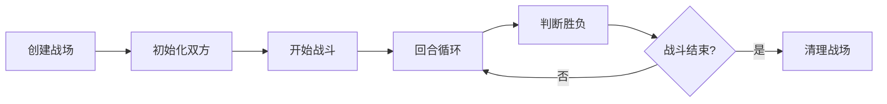

# 战斗服务通俗易懂指南

## 概述

战斗服务就像游戏里的**虚拟裁判**，负责管理所有战斗相关的逻辑。本文档用最简单的方式解释战斗服务是如何工作的。

## 1. 战斗服务是什么？

### 1.1 虚拟裁判的职责

想象一下，战斗服务就像是游戏里的**虚拟裁判**，负责：

- 📋 **记录战斗规则** - 谁能攻击谁，伤害怎么算
- ⚖️ **判断战斗结果** - 谁赢了，谁输了
- 🎲 **掷骰子决定运气** - 是否命中，是否暴击
- 📊 **计算伤害数值** - 扣多少血，加多少buff

### 1.2 从代码文件说起

```go
// action_options.go - 定义角色的行动选项
type ActionOptions struct {
    Type     define.ECombatActionType // 行动类型：攻击/技能/移动
    TargetId int64                    // 目标ID：我要打谁？
}
```

**翻译成人话**：
- `Type` = "我要做什么"（攻击、使用技能、移动）
- `TargetId` = "我要对谁做"（3号敌人、队友等）

## 2. 战斗场景 - 就像虚拟战场

### 2.1 什么是战斗场景？

想象一下，**战斗场景就像一个虚拟的战场**：

- 🏟️ **战场环境** - 有固定的地图、规则和边界
- 👥 **参战双方** - 攻击方 vs 防守方，各自有多个角色
- ⏰ **时间管理** - 控制回合数、行动顺序、战斗时长
- 🎲 **随机数控制** - 确保每次战斗的随机事件都可以重现
- 📊 **数据记录** - 记录所有战斗过程和结果

```go
// 战斗场景就像一个虚拟战场
type Scene struct {
    id          int64                    // 战场编号
    curRound    int32                    // 当前第几回合
    maxRound    int32                    // 最多打几回合
    camps       [2]*SceneCamp            // 双方阵营
    entityMap   *treemap.Map             // 战场上的所有角色
    rand        *random.FakeRandom[int]  // 战场专用随机数生成器
    result      chan bool                // 战斗结果通道
}
```

### 2.2 场景生命周期



**场景管理就像体育场管理**：
1. **开场准备** - 创建战场，安排双方入场
2. **比赛进行** - 控制回合，执行规则
3. **结果判定** - 决定胜负，记录数据
4. **场地清理** - 战斗结束后清理资源

### 2.3 战斗流程 - 就像下棋

### 2.4 场景中的具体战斗例子

**战斗场景**: 森林地图，玩家的法师 vs 敌人的战士

```
=== 战斗场景初始化 ===
场景ID: 12345
地图: 森林战场
最大回合: 20回合
随机种子: 67890 (确保战斗可重现)

攻击方阵营: 玩家法师(位置1)
防守方阵营: 敌人战士(位置1)

=== 战斗开始 ===
回合1 - 法师行动:
1. 场景判定     → "轮到攻击方阵营行动"
2. 选择行动     → "法师使用火球术"
3. 选择目标     → "攻击防守方战士"
4. 场景计算     → "使用场景随机数判定命中"
5. 伤害应用     → "战士血量更新，场景记录伤害"
6. 回合切换     → "场景切换到防守方回合"
```

### 2.5 场景的重要作用

**为什么需要场景？**

1. **🏟️ 隔离战斗** - 每个战斗都在独立的场景中，互不影响
2. **⏰ 时间控制** - 场景控制回合数，防止战斗无限进行
3. **🎲 随机一致** - 场景内的随机数可以重现，便于调试
4. **📊 数据管理** - 场景记录所有战斗数据，便于分析
5. **🔄 资源管理** - 战斗结束后场景自动清理，释放内存

## 3. 核心系统详解

### 3.1 🎯 技能系统 = 武器库

```go
// 就像你的武器库
技能列表:
├── 普通攻击: 伤害100，无冷却，无消耗
├── 火球术:   伤害200，冷却3回合，消耗魔法20
├── 治疗术:   回血150，冷却2回合，消耗魔法15
└── 大招:     伤害500，冷却10回合，消耗魔法50
```

**技能使用流程**：
1. **检查冷却** - 技能是否可用？
2. **检查资源** - 魔法值够不够？
3. **选择目标** - 攻击敌人还是治疗队友？
4. **计算效果** - 造成多少伤害或治疗？
5. **应用结果** - 扣血、回血、加状态

### 3.2 💊 Buff系统 = 临时状态

```go
// 就像游戏中的临时效果
状态效果:
├── 中毒: 每回合扣血20点，持续5回合
├── 加速: 攻击速度+50%，持续3回合  
├── 护盾: 吸收300点伤害，持续到被打破
├── 燃烧: 每回合扣血15点，持续3回合
└── 治疗: 每回合回血30点，持续4回合
```

**Buff管理**：
- **添加Buff** - 技能命中时添加
- **更新Buff** - 每回合结束时更新持续时间
- **移除Buff** - 持续时间到期或被驱散
- **叠加规则** - 相同Buff如何处理

### 3.3 📊 属性系统 = 角色数值

```go
// 就像角色的基本属性
属性计算公式: 最终值 = 基础值 * (1 + 百分比加成)

例子:
攻击力 = 基础100 + 装备50 + buff20 = 最终170
防御力 = 基础80  + 装备30 + buff10 = 最终120  
生命值 = 基础500 + 等级100 = 最终600
魔法值 = 基础200 + 装备50 = 最终250
```

**属性类型**：
- **基础属性** - 角色等级决定
- **装备属性** - 装备提供的加成
- **临时属性** - Buff提供的临时加成
- **最终属性** - 实际战斗中使用的数值

### 3.4 🎲 随机系统 = 运气判定

```go
// 就像掷骰子
随机判定:
├── 命中判定: 我的命中85% vs 敌人闪避15% = 70%几率命中
├── 暴击判定: 我的暴击20% vs 敌人韧性5%  = 15%几率暴击
├── 伤害浮动: 基础伤害100，浮动±10% = 实际90-110伤害
└── 技能触发: Buff触发几率30% = 30%几率生效
```

**随机数特点**：
- **可重现** - 使用固定种子，战斗结果可以重放
- **公平性** - 保证长期概率准确
- **平衡性** - 避免过度依赖运气

## 4. 伤害计算 - 数学公式

### 4.1 完整伤害公式

```
最终伤害 = (基础伤害 + 固定伤害) × 各种系数 + 真实伤害

详细展开:
最终伤害 = (攻击力 × 技能倍率 + 技能固定伤害) 
         × (1 + 元素伤害加成%) 
         × (1 - 护甲减免%) 
         × (1 - 元素抗性%) 
         × (1 + 总伤害加成%) 
         × 伤害浮动系数 
         × (1 + 暴击伤害%) 
         + 真实伤害
```

### 4.2 实际计算例子

```
法师攻击战士:
1. 基础伤害 = 攻击力150 × 火球术倍率200% = 300
2. 元素加成 = 300 × (1 + 火系精通30%) = 390
3. 护甲减免 = 390 × (1 - 护甲减免20%) = 312
4. 元素抗性 = 312 × (1 - 火抗10%) = 281
5. 伤害浮动 = 281 × 随机系数95% = 267
6. 暴击加成 = 267 × (1 + 暴击伤害50%) = 400 (如果暴击)
7. 最终伤害 = 267点 (普通) 或 400点 (暴击)
```

## 5. 实际战斗演示

### 5.1 完整场景战斗回合

```
=== 战斗场景创建 ===
场景ID: 88888
场景类型: 1v1决斗
地图: 竞技场
随机种子: 12345
最大回合: 15

=== 角色入场 ===
攻击方: 法师(HP:300/300, MP:200/200)
防守方: 战士(HP:500/500)

=== 战斗开始 ===
当前回合: 1/15

回合1 - 攻击方(法师)行动:
1. 场景提示: "轮到攻击方行动"
2. 选择技能: 火球术 (消耗MP:20)
3. 选择目标: 防守方战士
4. 场景随机: 使用种子12345生成随机数
5. 命中判定: 85% > 场景随机数73% ✅ 命中！
6. 暴击判定: 20% < 场景随机数45% ❌ 不暴击
7. 伤害计算: 场景计算最终伤害312点
8. 效果应用:
   - 战士血量: 500 → 188 (场景更新)
   - 获得燃烧状态(3回合) (场景记录)
   - 法师魔法: 200 → 180 (场景更新)
9. 场景切换: 切换到防守方回合

当前回合: 2/15

回合2 - 防守方(战士)行动:
1. 场景更新: 先处理燃烧状态，扣血20点 (188 → 168)
2. 场景提示: "轮到防守方行动"
3. 选择技能: 普通攻击
4. 选择目标: 攻击方法师
5. 命中判定: 90% > 场景随机数12% ✅ 命中！
6. 伤害计算: 场景计算最终伤害110点
7. 效果应用: 法师血量 300 → 190 (场景更新)
8. 场景切换: 切换到攻击方回合

当前回合: 3/15

回合3 - 攻击方(法师)行动:
1. 选择技能: 治疗术 (消耗MP:15)
2. 选择目标: 自己
3. 治疗效果: 场景计算回血150点 (190 → 300, 满血)
4. 资源更新: 法师魔法 180 → 165 (场景记录)

... 战斗在场景中继续进行 ...

=== 战斗结束 ===
第8回合，战士血量归零
胜利方: 攻击方(法师)
场景记录: 保存完整战斗数据
场景清理: 释放内存资源
```

## 6. 系统设计优势

### 6.1 为什么需要这么复杂？

**简单回答**: 为了让战斗有趣！

- **🎮 策略性**: 不同技能有不同效果，需要思考选择
- **🎲 随机性**: 有运气成分，增加刺激感和不确定性
- **📈 成长性**: 属性可以提升，装备有意义，有进步感
- **⚖️ 平衡性**: 确保没有无敌的策略，保持游戏公平

### 6.2 与知名游戏的对比

| 游戏 | 相似系统 | 特点 |
|------|----------|------|
| **王者荣耀** | 技能冷却、伤害计算 | 实时战斗 |
| **最终幻想** | ATB条、元素系统 | 回合制经典 |
| **博德之门3** | 状态效果、随机判定 | D&D规则 |
| **暗黑地牢** | 位置系统、压力机制 | 独特创新 |

## 7. 技术实现亮点

### 7.1 精确计算

```go
// 使用decimal库避免浮点误差
攻击力 := decimal.NewFromInt32(150)
倍率 := decimal.NewFromFloat(2.0)
最终伤害 := 攻击力.Mul(倍率).Round(0).IntPart()
```

### 7.2 可重现随机

```go
// 使用固定种子的随机数生成器
rand := random.FakeRandom[int]{Seed: battleSeed}
命中判定 := rand.Intn(100) < 命中率
```

### 7.3 模块化设计

```go
// 各系统独立，易于扩展
战斗控制器 {
    技能系统
    Buff系统  
    属性系统
    行动系统
}
```

## 8. 总结

### 8.1 一句话概括

**战斗服务就是一个超级复杂的计算器，它能模拟真实的战斗过程，让玩家感觉像在玩一个公平、有趣、有策略的战斗游戏。**

### 8.2 核心价值

1. **公平性** - 所有计算都是透明和一致的
2. **趣味性** - 复杂的系统交互产生丰富的策略
3. **可扩展** - 模块化设计便于添加新功能
4. **高性能** - 优化的算法确保流畅的游戏体验

### 8.3 类比理解

就像你在玩《王者荣耀》时：
- **进入战场** → Scene (战斗场景)
- **选择技能** → ActionOptions (行动选项)
- **计算伤害** → 伤害公式系统
- **显示效果** → 战斗反馈系统
- **判断胜负** → 战斗结果判定
- **离开战场** → 场景清理和资源释放

**场景就像游戏中的"房间"**：
- 每场战斗都在独立的"房间"里进行
- "房间"有自己的规则和环境
- 战斗结束后"房间"会被清理
- 多个"房间"可以同时存在，互不干扰

战斗服务把这些复杂的计算都在后台自动完成，让玩家只需要专注于策略和操作，享受战斗的乐趣！

---

*文档生成时间: 2025-01-17*  
*项目: East Eden Game Server - Combat Service*  
*版本: v1.0 (通俗易懂版)*
