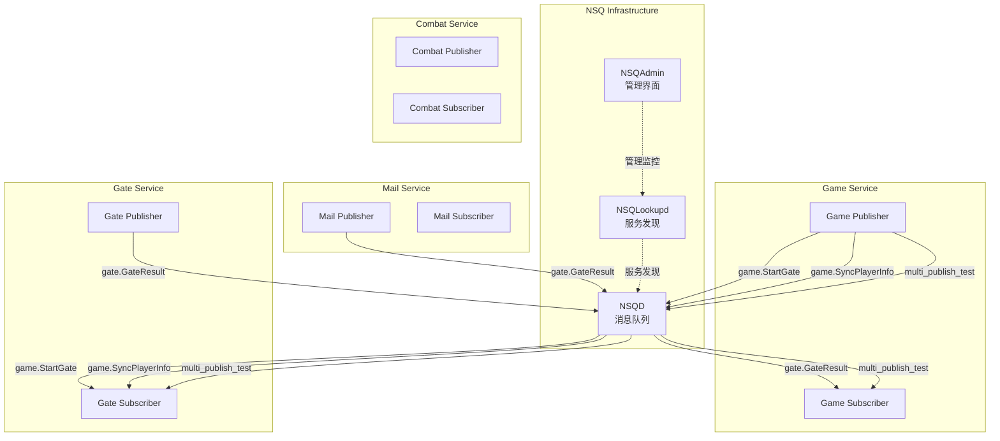

# 本项目NSQ使用场景系统性总结

## 1. NSQ基础架构

### 1.1 NSQ组件部署

```yaml
# NSQ Lookup服务 - 服务发现
nsqlookupd:
  image: nsqio/nsq
  command: /nsqlookupd -log-level=info
  ports:
    - "4160:4160"  # TCP端口
    - "4161:4161"  # HTTP端口

# NSQ消息队列服务
nsqd:
  image: nsqio/nsq
  command: /nsqd --data-path=/nsq_data -log-level=info -lookupd-tcp-address=nsqlookupd:4160
  ports:
    - "4150:4150"  # TCP端口
    - "4151:4151"  # HTTP端口

# NSQ管理界面
nsqadmin:
  image: nsqio/nsq
  command: /nsqadmin -lookupd-http-address=nsqlookupd:4161
  ports:
    - "4171:4171"  # Web管理界面
```

### 1.2 NSQ配置策略

- **开发环境**: 使用HTTP broker (`broker_debug = "http"`)
- **生产环境**: 使用NSQ broker (`broker_release = "nsq"`)
- **地址配置**: `broker_address_release = "localhost:4150"`

## 2. 微服务架构中的NSQ使用



## 3. 具体使用场景分析

### 3.1 Game服务 - 核心消息发布者

```go
// Game服务作为发布者
ps.pubStartGate = micro.NewEvent("game.StartGate", g.mi.srv.Client())
ps.pubSyncPlayerInfo = micro.NewEvent("game.SyncPlayerInfo", g.mi.srv.Client())
ps.pubMultiPublicTest = micro.NewEvent("multi_publish_test", g.mi.srv.Client())

// Game服务作为订阅者
micro.RegisterSubscriber("gate.GateResult", g.mi.srv.Server(), handler)
micro.RegisterSubscriber("multi_publish_test", g.mi.srv.Server(), handler)
```

**使用场景**：
- **服务启动通知**: `game.StartGate` - 通知Gate服务游戏服务器已启动
- **玩家信息同步**: `game.SyncPlayerInfo` - 同步玩家数据到Gate服务
- **系统测试**: `multi_publish_test` - 用于系统测试和调试
- **接收Gate结果**: 订阅`gate.GateResult`处理Gate服务的响应

### 3.2 Gate服务 - 网关消息处理

```go
// Gate服务作为发布者
ps.pubGateResult = micro.NewEvent("gate.GateResult", g.mi.srv.Client())

// Gate服务作为订阅者
micro.RegisterSubscriber("game.StartGate", g.mi.srv.Server(), handler.ProcessStartGate)
micro.RegisterSubscriber("game.SyncPlayerInfo", g.mi.srv.Server(), handler.ProcessSyncPlayerInfo)
micro.RegisterSubscriber("multi_publish_test", g.mi.srv.Server(), handler.ProcessMultiPublishTest)
```

**使用场景**：
- **处理游戏启动**: 接收`game.StartGate`，更新游戏服务器状态
- **同步玩家信息**: 接收`game.SyncPlayerInfo`，更新玩家缓存
- **发布处理结果**: 通过`gate.GateResult`向其他服务反馈处理结果
- **测试支持**: 参与系统测试流程

### 3.3 Mail服务 - 邮件系统

```go
// Mail服务作为发布者
ps.pubGateResult = micro.NewEvent("gate.GateResult", m.mi.srv.Client())

// 发布邮件处理结果
func (ps *PubSub) PubGateResult(ctx context.Context, win bool) error {
    info := &pbGlobal.AccountInfo{Id: 1, Name: "pub_client"}
    return ps.pubGateResult.Publish(ctx, &pbPubSub.PubGateResult{Info: info, Win: win})
}
```

**使用场景**：
- **邮件处理结果**: 发布邮件处理结果到`gate.GateResult`
- **与Gate服务交互**: 通知Gate服务邮件系统的处理状态

### 3.4 Combat服务 - 战斗系统

```go
// Combat服务的PubSub功能目前被注释掉
// 表明战斗系统可能还在开发中或使用其他通信方式

//ps.pubStartGate = micro.NewPublisher("game.StartGate", c.mi.srv.Client())
//ps.pubExpirePlayer = micro.NewPublisher("game.ExpirePlayer", c.mi.srv.Client())
//ps.pubExpireLitePlayer = micro.NewPublisher("game.ExpireLitePlayer", c.mi.srv.Client())
```

**使用场景**：
- **预留功能**: 为战斗结果通知、玩家过期等功能预留了NSQ接口
- **未来扩展**: 可能用于战斗结果广播、玩家状态同步等

## 4. NSQ消息类型和数据结构

### 4.1 消息类型定义

```go
// 游戏启动通知
type PubStartGate struct {
    MsgId int64               `protobuf:"varint,1,opt,name=msgId,proto3"`
    Info  *global.AccountInfo `protobuf:"bytes,2,opt,name=info,proto3"`
}

// 玩家信息同步
type PubSyncPlayerInfo struct {
    MsgId int64              `protobuf:"varint,1,opt,name=msgId,proto3"`
    Info  *global.PlayerInfo `protobuf:"bytes,2,opt,name=info,proto3"`
}

// Gate处理结果
type PubGateResult struct {
    MsgId int64               `protobuf:"varint,1,opt,name=msgId,proto3"`
    Info  *global.AccountInfo `protobuf:"bytes,2,opt,name=info,proto3"`
    Win   bool                `protobuf:"varint,3,opt,name=win,proto3"`
}
```

### 4.2 消息特点

- **唯一ID**: 所有消息都包含`MsgId`，使用雪花算法生成，用于去重
- **结构化数据**: 使用Protocol Buffers定义消息结构
- **业务数据**: 包含具体的业务信息（账户信息、玩家信息等）

## 5. NSQ使用模式总结

### 5.1 发布/订阅模式
```
Publisher → Topic → NSQ → Subscriber(s)
```

### 5.2 队列模式
```go
// 使用队列确保消息的负载均衡
server.SubscriberQueue("gate.GateResult")
```

### 5.3 消息去重机制
```go
func (s *SubscriberHandler) isDunplicateMsg(id int64) bool {
    _, found := s.cacheUniqueId.Get(id)
    return found
}
```

## 6. NSQ在项目中的优势

### 6.1 服务解耦
- 服务间通过消息队列通信，降低直接依赖
- 支持服务的独立部署和扩展

### 6.2 异步处理
- 消息发布不阻塞业务逻辑
- 提高系统整体响应性能

### 6.3 可靠性
- 消息持久化存储
- 支持消息重试和错误处理

### 6.4 可扩展性
- 支持多实例部署
- 动态添加发布者和订阅者

### 6.5 监控管理
- NSQAdmin提供Web界面监控
- 实时查看队列状态和消息流量

## 7. 当前使用状态

### 7.1 活跃使用
- ✅ **Game服务**: 完整的发布/订阅功能
- ✅ **Gate服务**: 完整的发布/订阅功能  
- ✅ **Mail服务**: 基础发布功能

### 7.2 预留功能
- 🔄 **Combat服务**: 功能被注释，可能在开发中

### 7.3 主要Topic

| Topic | 发布者 | 订阅者 | 用途 |
|-------|--------|--------|------|
| `game.StartGate` | Game | Gate | 游戏服务启动通知 |
| `game.SyncPlayerInfo` | Game | Gate | 玩家信息同步 |
| `gate.GateResult` | Gate, Mail | Game | 处理结果反馈 |
| `multi_publish_test` | Game | Game, Gate | 系统测试 |

## 8. 配置文件中的NSQ设置

### 8.1 Game服务配置
```toml
# config/game/config.toml
registry_debug = "mdns"
broker_debug = "http"

registry_release = "consul"
registry_address_release = "localhost:8500"
broker_release = "nsq"
broker_address_release = "localhost:4150"
```

### 8.2 Gate服务配置
```toml
# config/gate/config.toml
registry_debug = "mdns"
broker_debug = "http"

registry_release = "consul"
registry_address_release = "localhost:8500"
broker_release = "nsq"
broker_address_release = "localhost:4150"
```

### 8.3 Combat服务配置
```toml
# config/combat/config.toml
registry_debug = "mdns"
broker_debug = "http"

registry_release = "consul"
registry_address_release = "localhost:8500"
broker_release = "nsq"
broker_address_release = "localhost:4150"
```

## 9. 总结

NSQ在本项目中主要用于：

1. **服务间通信**: 实现微服务之间的异步消息传递
2. **状态同步**: 同步玩家信息、服务状态等关键数据
3. **事件通知**: 服务启动、处理结果等事件的广播
4. **系统测试**: 提供测试和调试支持

这种设计实现了**事件驱动架构**，是现代分布式游戏服务器的标准实践。通过NSQ，项目实现了：

- **松耦合**: 服务间通过消息队列解耦
- **高可用**: 消息持久化和重试机制
- **可扩展**: 支持水平扩展和负载均衡
- **可监控**: 通过NSQAdmin实时监控消息流量

---

*文档生成时间: 2025-01-17*
*项目: East Eden Game Server*
*版本: v1.0*
