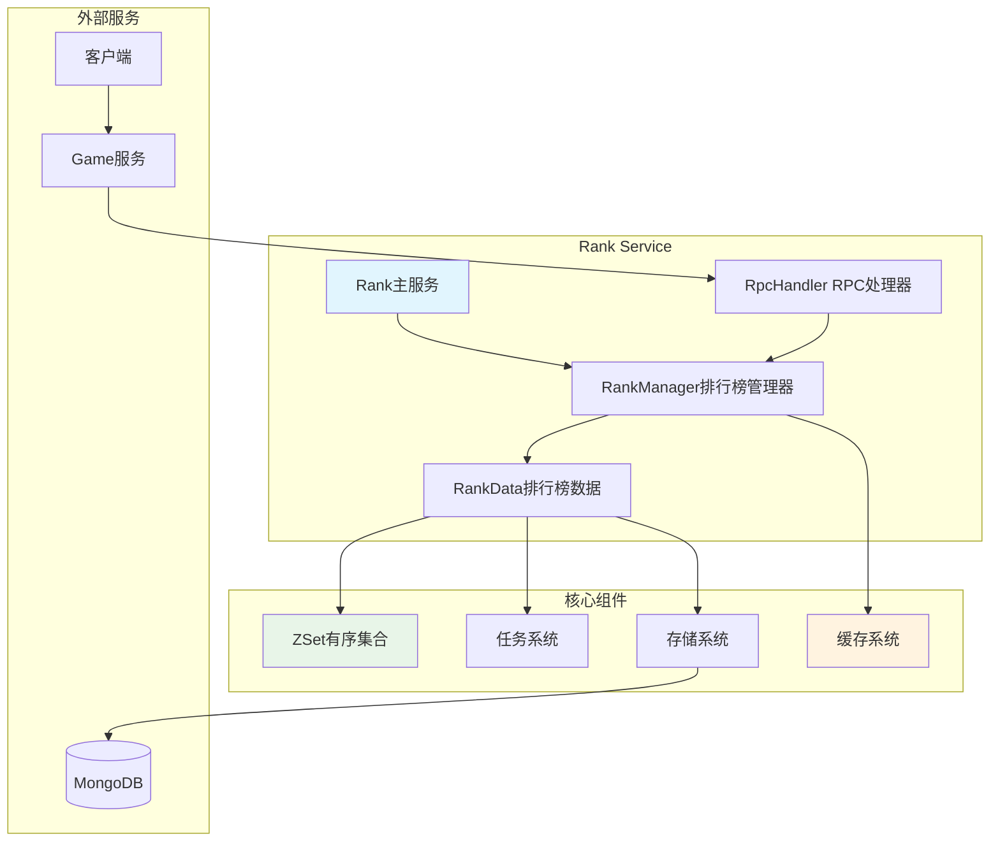

# Rank服务设计详解

## 概述

Rank服务是一个高性能的分布式排行榜系统，基于跳表数据结构实现，支持多种排行榜类型和大规模并发查询。本文档详细分析Rank服务的架构设计、核心算法和性能优化策略。

## 1. 整体架构设计

### 1.1 服务架构



### 1.2 核心组件职责

- **Rank**: 主服务，负责整体协调和生命周期管理
- **RankManager**: 排行榜管理器，负责缓存管理和分布式协调
- **RankData**: 单个排行榜数据，包含业务逻辑和数据操作
- **ZSet**: 有序集合，基于跳表实现的高性能数据结构
- **RpcHandler**: RPC接口处理器，提供对外服务接口

## 2. 核心数据结构

### 2.1 排行榜数据结构

```go
// 排行榜数据
type RankData struct {
    RankId         int32           `json:"_id" bson:"_id"`
    LastSaveNodeId int32           `json:"last_save_node_id" bson:"last_save_node_id"`
    NodeId         int16           `json:"-" bson:"-"` // 当前节点id
    zsets          *zset.SortedSet `json:"-" bson:"-"` // 排行zset
    tasker         *task.Tasker    `json:"-" bson:"-"`
    rpcHandler     *RpcHandler     `json:"-" bson:"-"`
    entry          *auto.RankEntry `json:"-" bson:"-"`
}
```

**设计特点**：
- **分布式标识**: LastSaveNodeId和NodeId用于分布式节点管理
- **内存数据结构**: zsets提供高性能的排序和查询
- **异步处理**: tasker支持异步任务处理
- **配置驱动**: entry包含排行榜的配置信息

### 2.2 排行榜元数据

```go
// 排行榜元数据
type RankMetadata struct {
    RankKey `json:"_id" bson:"_id"` // 排行榜key
    ObjName string                  `json:"name" bson:"name"`   // 排行数据名字
    Score   float64                 `json:"score" bson:"score"` // 排行榜得分
    Date    int64                   `json:"date" bson:"date"`   // 分数更新时间
}

// 排行榜复合键值
type RankKey struct {
    ObjId  int64 `json:"obj_id" bson:"obj_id"`   // 排行榜对象id
    RankId int32 `json:"rank_id" bson:"rank_id"` // 排行榜id
}
```

**复合键设计**：
- **唯一标识**: ObjId + RankId 确保数据唯一性
- **时间戳**: Date字段用于处理同分情况的排序
- **灵活性**: 支持玩家、公会等不同对象类型

## 3. 排行榜管理器设计

### 3.1 缓存管理策略

```go
type RankManager struct {
    r              *Rank
    cacheRankDatas *cache.Cache    // 排行榜缓存
    rankPool       sync.Pool       // 对象池
    wg             utils.WaitGroupWrapper
    mu             sync.Mutex
}

// 缓存配置
var (
    rankCleanupInterval = 1 * time.Minute // 缓存清理间隔
    rankCacheExpire     = 1 * time.Hour   // 缓存过期时间：1小时
)
```

**缓存策略**：
- **1小时过期**: 平衡性能和数据新鲜度
- **1分钟清理**: 定期清理过期缓存，释放内存
- **对象池复用**: 减少GC压力和内存分配开销
- **过期回调**: 自动停止任务和回收资源

### 3.2 分布式缓存管理

```go
func (m *RankManager) getRankData(rankId int32) (*RankData, error) {
    cache, ok := m.cacheRankDatas.Get(rankId)
    
    if ok {
        // 缓存命中
        rd := cache.(*RankData)
        if rd.IsTaskRunning() {
            return rd, nil
        }
    } else {
        // 缓存未命中，从数据库加载
        cache = m.rankPool.Get()
        rd := cache.(*RankData)
        rd.Init(m.r.ID, m.r.rpcHandler)
        err := rd.Load(rankId)
        
        // 踢掉其他节点的缓存，确保数据一致性
        if rd.LastSaveNodeId != -1 && rd.LastSaveNodeId != int32(m.r.ID) {
            err := m.KickRankData(rd.RankId, rd.LastSaveNodeId)
        }
        
        m.cacheRankDatas.Set(rankId, cache, rankCacheExpire)
    }
    
    return rd, nil
}
```

**分布式特性**：
- **节点感知**: 通过LastSaveNodeId跟踪数据归属
- **缓存迁移**: 自动踢出其他节点的过期缓存
- **一致性保证**: 确保同一排行榜只在一个节点活跃

## 4. 有序集合（ZSet）实现

### 4.1 跳表数据结构

```go
type SortedSet struct {
    dict map[int64]*obj    // 哈希表：O(1)查找
    zsl  *skipList         // 跳表：有序存储
}

type skipListNode struct {
    objID     int64              // 对象ID
    score     float64            // 分数
    timeStamp int64              // 时间戳（处理同分情况）
    backward  *skipListNode      // 后向指针
    level     []*skipListLevel   // 多层级指针
}
```

**跳表优势**：
- **O(log n)查找**: 平均时间复杂度优秀
- **O(log n)插入/删除**: 高效的更新操作
- **范围查询**: 支持高效的TOP N查询
- **内存友好**: 相比红黑树更节省内存
- **实现简单**: 相比B+树更容易实现和维护

### 4.2 核心操作实现

```go
// 设置分数
func (z *SortedSet) Set(score float64, key int64, timeStamp int64, dat any) {
    v, ok := z.dict[key]
    z.dict[key] = &obj{attachment: dat, key: key, score: score}
    if ok {
        // 分数变化时重新插入
        if score != v.score {
            z.zsl.zslDelete(v.score, key)
            z.zsl.zslInsert(score, key, timeStamp)
        }
    } else {
        z.zsl.zslInsert(score, key, timeStamp)
    }
}

// 获取排名
func (z *SortedSet) GetRank(key int64, reverse bool) (rank int64, score float64, data any) {
    v, ok := z.dict[key]
    if !ok {
        return -1, 0, nil
    }
    r := z.zsl.zslGetRank(v.score, key)
    if reverse {
        r = z.zsl.length - r  // 降序排列
    } else {
        r--  // 升序排列（0-based）
    }
    return int64(r), v.score, v.attachment
}
```

**操作特点**：
- **双重索引**: 哈希表提供O(1)查找，跳表提供有序遍历
- **分数更新**: 智能检测分数变化，只在必要时重新排序
- **排序方向**: 支持升序和降序两种排列方式

## 5. 排行榜业务逻辑

### 5.1 分数设置

```go
func (r *RankData) SetScore(ctx context.Context, rankMetadata *define.RankMetadata) error {
    if rankMetadata == nil {
        return ErrInvalidRankMetadata
    }

    rr := &define.RankMetadata{}
    *rr = *rankMetadata

    // 降序排列时分数取负值（跳表内部统一按升序处理）
    if r.entry.Desc {
        rr.Score *= -1
    }

    // 更新内存中的排行榜
    r.zsets.Set(rr.Score, rr.ObjId, rr.Date, rr)

    // 异步持久化到数据库
    err := store.GetStore().UpdateOne(ctx, define.StoreType_Rank, rr.RankKey, rr)
    
    // 更新节点信息
    r.saveLastNode()
    return err
}
```

### 5.2 排名查询

```go
// 根据对象ID查询排名
func (r *RankData) GetRankByObjId(ctx context.Context, objId int64) (rank int64, metadata define.RankMetadata, err error) {
    zRank, _, data := r.zsets.GetRank(objId, false)
    rank = zRank
    if data == nil {
        err = ErrRankNotExist
        return
    }

    metadata = *data.(*define.RankMetadata)
    // 降序时恢复原始分数
    if r.entry.Desc {
        metadata.Score *= -1
    }

    return rank, metadata, nil
}

// 根据排名范围查询
func (r *RankData) GetRankByRange(ctx context.Context, start, end int64) (metadatas []define.RankMetadata, err error) {
    r.zsets.Range(start, end, func(score float64, key int64, data any) {
        rr := *data.(*define.RankMetadata)
        if r.entry.Desc {
            rr.Score *= -1  // 恢复原始分数
        }
        metadatas = append(metadatas, rr)
    })
    return
}
```

**查询特点**：
- **单点查询**: 快速查询指定对象的排名和分数
- **范围查询**: 支持TOP N等范围查询需求
- **分数还原**: 自动处理降序排列的分数转换

## 6. RPC接口设计

### 6.1 查询接口

```go
// 查询单个对象排名
func (h *RpcHandler) QueryRankByObjId(
    ctx context.Context,
    req *pbRank.QueryRankByObjIdRq,
    rsp *pbRank.QueryRankByObjIdRs,
) error {
    rank, metadata, err := h.m.manager.QueryRankByObjId(ctx, req.GetRankId(), req.GetObjId())
    if utils.ErrCheck(err, "QueryRankByObjId failed") {
        rsp.RankIndex = int32(rank)
        rsp.Metadata = metadata.ToPB()
    }
    return err
}

// 查询排名范围
func (h *RpcHandler) QueryRankByRange(
    ctx context.Context,
    req *pbRank.QueryRankByRangeRq,
    rsp *pbRank.QueryRankByRangeRs,
) error {
    metadatas, err := h.m.manager.QueryRankByRange(ctx, req.GetRankId(), req.GetStart(), req.GetEnd())
    rsp.Metadatas = make([]*pbGlobal.RankMetadata, 0, len(metadatas))
    for _, metadata := range metadatas {
        rsp.Metadatas = append(rsp.Metadatas, metadata.ToPB())
    }
    return err
}
```

### 6.2 分布式管理接口

```go
// 踢出排行榜缓存
func (h *RpcHandler) KickRankData(
    ctx context.Context,
    req *pbRank.KickRankDataRq,
    rsp *pbRank.KickRankDataRs,
) error {
    return h.m.manager.KickRankData(req.GetRankId(), req.GetRankNodeId())
}
```

## 7. 任务系统集成

### 7.1 异步任务处理

```go
func (m *RankManager) AddTask(ctx context.Context, rankId int32, fn task.TaskHandler) error {
    rd, err := m.getRankData(rankId)
    if err != nil {
        return err
    }
    return rd.AddTask(ctx, fn, rd)
}

// 查询排行（异步）
func (m *RankManager) QueryRankByObjId(ctx context.Context, rankId int32, objId int64) (rank int64, metadata define.RankMetadata, err error) {
    err = m.AddTask(
        ctx,
        rankId,
        func(c context.Context, p ...any) error {
            var e error
            rankData := p[0].(*RankData)
            rank, metadata, e = rankData.GetRankByObjId(c, objId)
            return e
        },
    )
    return
}
```

**异步处理优势**：
- **并发安全**: 所有操作通过任务队列串行化
- **性能提升**: 避免阻塞主线程
- **错误隔离**: 任务失败不影响其他操作

## 8. 配置系统

### 8.1 排行榜配置

```csv
# Rank.csv
排行榜ID,排行名称,刷新方式,是否仅为本服排行榜,是否降序排序
1,本服玩家等级榜,0,1,1
2,全服玩家等级榜,0,0,1
```

### 8.2 排行榜类型

```go
const (
    RankId_Begin             = iota
    RankId_LocalPlayerLevel  // 本服玩家等级榜
    RankId_GlobalPlayerLevel // 全服玩家等级榜
    RankId_End
)
```

**配置特点**：
- **类型丰富**: 支持本服和全服排行榜
- **刷新策略**: 支持不刷新、跨天、跨周、跨月刷新
- **排序方式**: 支持升序和降序排列
- **动态配置**: 通过配置表动态调整排行榜行为

## 9. 分布式设计特点

### 9.1 一致性哈希

```go
// 一致性哈希选择节点
func (h *RpcHandler) consistentHashCallOption(key string) client.CallOption {
    return client.WithSelectOption(
        utils.ConsistentHashSelector(h.m.cons, key),
    )
}
```

### 9.2 节点间缓存同步

```go
// 踢出其他节点缓存
if rd.LastSaveNodeId != -1 && rd.LastSaveNodeId != int32(m.r.ID) {
    err := m.KickRankData(rd.RankId, rd.LastSaveNodeId)
}
```

**分布式特性**：
- **负载均衡**: 一致性哈希确保请求均匀分布
- **数据一致性**: 智能的缓存迁移机制
- **故障恢复**: 节点故障时自动迁移数据

## 10. 性能优化策略

### 10.1 内存优化

- **对象池**: 复用RankData对象，减少GC压力
- **缓存过期**: 自动清理不活跃的排行榜
- **跳表结构**: 内存使用效率高于红黑树

### 10.2 查询优化

- **双重索引**: 哈希表O(1)查找 + 跳表O(log n)排序
- **范围查询**: 跳表天然支持高效的范围查询
- **异步处理**: 所有操作异步化，提升并发能力

### 10.3 并发优化

- **读写分离**: 查询和更新操作分离处理
- **任务队列**: 避免并发冲突，确保数据一致性
- **分布式缓存**: 多节点负载均衡

### 10.4 存储优化

- **批量操作**: 支持批量更新排行榜数据
- **索引优化**: MongoDB复合索引提升查询性能
- **数据压缩**: 合理的数据结构减少存储空间

## 11. 监控和运维

### 11.1 性能指标

- **QPS监控**: 查询和更新的每秒请求数
- **延迟监控**: 接口响应时间分布
- **缓存命中率**: 缓存效果评估
- **内存使用**: 跳表和缓存的内存占用

### 11.2 告警机制

- **服务可用性**: 服务健康状态监控
- **数据一致性**: 节点间数据同步状态
- **性能异常**: 响应时间和错误率告警

## 总结

Rank服务是一个设计完善的分布式排行榜系统，具有以下特点：

### 🚀 核心特性
- **高性能**: 基于跳表的O(log n)操作复杂度
- **分布式**: 支持多节点部署和负载均衡
- **缓存优化**: 多层缓存提升查询性能
- **异步处理**: 任务系统确保高并发处理能力

### 💡 技术亮点
- **跳表实现**: 自研的高性能有序集合
- **分布式缓存**: 智能的节点间缓存管理
- **对象池**: 内存优化和GC压力减少
- **配置驱动**: 灵活的排行榜类型配置

### 🔧 扩展性
- **多种排行榜**: 支持本服和全服排行榜
- **刷新策略**: 支持多种刷新方式
- **排序方式**: 支持升序和降序排列
- **数据持久化**: MongoDB存储确保数据安全

### 📊 适用场景
- **游戏排行榜**: 等级榜、战力榜、财富榜等
- **社交排行**: 好友排行、公会排行等
- **活动排行**: 限时活动、竞赛排行等
- **实时榜单**: 需要实时更新的各类排行榜

这是一个能够支持大规模在线游戏排行榜需求的高性能分布式系统，在性能、可扩展性和可维护性方面都有出色的表现！

---

*文档生成时间: 2025-01-17*  
*项目: East Eden Game Server - Rank Service*  
*版本: v1.0*
