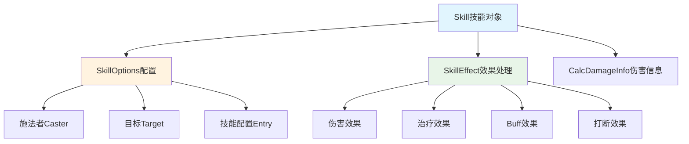
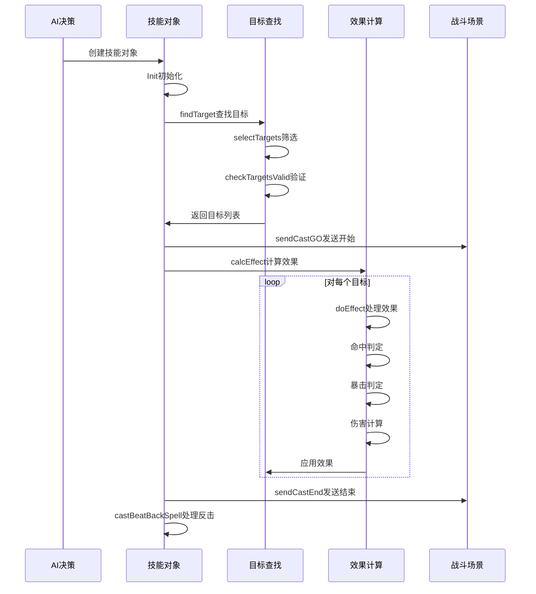

# 技能系统设计详解

## 概述

技能系统是战斗系统的核心组件，负责处理角色的特殊技能释放、效果计算和目标选择。本文档基于 `skill.go`、`skill_effect.go` 和 `skill_options.go` 三个核心文件，详细分析技能系统的设计架构。

## 1. 技能系统核心架构



### 1.1 核心组件关系

- **Skill**: 技能执行的主体对象
- **SkillOptions**: 技能配置和参数管理
- **SkillEffect**: 技能效果的具体处理逻辑
- **CalcDamageInfo**: 伤害计算结果的数据结构

## 2. 技能配置系统（SkillOptions）

### 2.1 配置数据结构

```go
type SkillOptions struct {
    Caster         *SceneEntity        // 施法者
    Target         *SceneEntity        // 目标
    TargetPosition *Position           // 目标位置
    
    Triggered bool                     // 是否被触发
    Amount    int32                    // 数量参数
    SpellType define.ESpellType        // 技能类型
    Level     uint32                   // 技能等级
    Entry     *auto.SkillBaseEntry     // 技能配置表数据
}
```

### 2.2 函数式选项模式

技能系统采用**函数式选项模式**进行配置：

```go
// 配置构建器函数
func WithSkillCaster(caster *SceneEntity) SkillOption
func WithSkillTarget(target *SceneEntity) SkillOption
func WithSpellType(tp define.ESpellType) SkillOption
func WithSpellLevel(level uint32) SkillOption

// 使用示例
skill := NewSkill(
    WithSkillCaster(caster),
    WithSkillTarget(target),
    WithSpellType(define.SpellType_Melee),
    WithSpellLevel(5),
)
```

**优势**：
- **灵活配置**: 可选参数，按需配置
- **类型安全**: 编译时检查参数类型
- **易于扩展**: 新增配置项不影响现有代码

### 2.3 技能类型分类

```go
// 技能类型枚举
const (
    SpellType_Melee        // 近战技能
    SpellType_Rage         // 怒气技能
    SpellType_Rune         // 符文技能
    SpellType_TriggerBeatBack // 反击技能
)
```

## 3. 技能执行流程（Skill.go）

### 3.1 完整施法流程

```go
func (s *Skill) Cast() {
    s.findTarget()        // 1. 查找目标
    s.sendCastGO()        // 2. 发送施法开始
    s.calcEffect()        // 3. 计算技能效果
    s.sendCastEnd()       // 4. 发送施法结束
    s.castBeatBackSpell() // 5. 处理反击
}
```

### 3.2 目标查找机制

```go
func (s *Skill) findTarget() {
    s.listTargets.Init()
    
    // 1. 获取场景中所有实体
    entities := s.GetScene().GetEntityMap()
    it := entities.Iterator()
    for it.Next() {
        s.listTargets.PushBack(it.Value())
    }
    
    // 2. 根据技能配置筛选目标
    s.selectTargets()
    
    // 3. 检查目标合法性
    s.checkTargetsValid()
}
```

**目标筛选流程**：
1. **全量获取**: 先获取场景中所有实体
2. **条件筛选**: 根据技能配置筛选有效目标
3. **合法性检查**: 验证目标状态、种族等限制

### 3.3 命中和暴击系统

#### 3.3.1 命中判定

```go
func (s *Skill) checkSkillHit(target *SceneEntity) bool {
    // 友方必命中
    if s.opts.Caster.GetCamp() == target.GetCamp() {
        s.damageInfo.Hit = true
        return true
    }
    
    // 敌方计算命中率
    hit := s.opts.Caster.GetAttManager().GetFinalAttValue(define.Att_Hit)
    dodge := target.GetAttManager().GetFinalAttValue(define.Att_Dodge)
    hitChance := hit.Sub(dodge).Mul(decimal.NewFromInt(define.PercentBase))
    
    // 保底命中率20%
    if hitChance < 2000 {
        hitChance = 2000
    }
    
    s.damageInfo.Hit = int(hitChance) >= s.GetScene().Rand(1, define.PercentBase)
    return s.damageInfo.Hit
}
```

**命中机制特点**：
- **友方必中**: 友方技能100%命中
- **保底机制**: 最低20%命中率
- **属性对抗**: 命中 vs 闪避

#### 3.3.2 暴击判定

```go
func (s *Skill) checkSkillCrit(target *SceneEntity) bool {
    critChance := s.opts.Caster.GetAttManager().GetFinalAttValue(define.Att_Crit)
    
    // 敌方计算韧性
    if target.GetCamp().camp != s.opts.Caster.GetCamp().camp {
        tenacity := target.GetAttManager().GetFinalAttValue(define.Att_Tenacity)
        critChance = critChance.Sub(tenacity)
    }
    
    crit := critChance.Mul(decimal.NewFromInt(define.PercentBase)).Round(0).IntPart()
    if crit < 0 {
        crit = 0
    }
    
    s.damageInfo.Crit = int(crit) >= s.GetScene().Rand(1, define.PercentBase)
    return s.damageInfo.Crit
}
```

**暴击机制特点**：
- **属性对抗**: 暴击率 vs 韧性
- **下限保护**: 暴击率不会为负
- **友方优势**: 友方不受韧性影响

## 4. 技能效果系统（SkillEffect.go）

### 4.1 效果处理器架构

```go
// 技能效果处理函数类型
type SkillEffectsHandler func(*Skill, *auto.SkillEffectEntry, *SceneEntity)

// 效果处理器注册
func register() {
    skillEffectsHandlers[define.SkillEffectDamage] = effectDamage      // 伤害效果
    skillEffectsHandlers[define.SkillEffectHeal] = effectHeal          // 治疗效果
    skillEffectsHandlers[define.SkillEffectInterrupt] = effectInterrupt // 打断效果
    skillEffectsHandlers[define.SkillEffectGather] = effectGather       // 聚集效果
    skillEffectsHandlers[define.SkillEffectAddBuff] = effectAddBuff     // 添加Buff
}

// 效果处理入口
func handleSkillEffect(s *Skill, effectEntry *auto.SkillEffectEntry, target *SceneEntity) {
    h, ok := skillEffectsHandlers[effectEntry.EffectType]
    if !ok {
        log.Error().Int32("effect_entry", effectEntry.Id).Msg("invalid skill effect type")
        return
    }
    
    h(s, effectEntry, target)
}
```

### 4.2 复杂伤害计算公式

```go
// 最终伤害 = (攻击力*技能伤害%+技能固定值) * (1+元素伤害加成%) * 
//          (1-护甲伤害减免) * (1-元素伤害抗性%) * 总伤害系数 * 
//          伤害浮动系数 * (1+暴击伤害%) + 真实伤害固定值

func effectDamage(s *Skill, effectEntry *auto.SkillEffectEntry, target *SceneEntity) {
    // A: 基础伤害部分
    partA := atk.Mul(damagePercent).Add(damageBase)
    
    // B: 元素伤害加成
    partB := decimal.NewFromInt32(1).Add(dmgInc)
    
    // C: 护甲减免
    partC := decimal.NewFromInt32(1).Sub(armorDec)
    
    // D: 元素抗性
    partD := decimal.NewFromInt32(1).Sub(dmgRes)
    
    // E: 总伤害系数
    partE := s.opts.Caster.GetAttManager().GetFinalAttValue(define.Att_SelfDmgInc)
    
    // F: 伤害浮动
    partF := random.DecimalFake(globalConfig.DamageRange[0], globalConfig.DamageRange[1], s.GetScene().GetRand())
    
    // G: 暴击伤害
    partG := calculateCritDamage()
    
    // H: 真实伤害
    partH := realDamageBase
    
    // 最终计算
    s.baseDamage = partA.Mul(partB).Mul(partC).Mul(partD).Mul(partE).Mul(partF).Mul(partG).Add(partH).Round(0).IntPart()
}
```

### 4.3 护甲减免计算

```go
// 护甲伤害减免 = 防御方护甲*(1-忽略防御%) / 
//              (防御方护甲*(1-忽略防御%) + 攻击方攻击*护甲常数)
armorDec := func() decimal.Decimal {
    armorPartA := armor.Mul(decimal.NewFromInt32(1).Sub(ignoreDefence))
    armorPartB := armorPartA.Add(atk.Mul(decimal.NewFromInt32(globalConfig.ArmorRatio)))
    return armorPartA.Div(armorPartB)
}()
```

**护甲减免特点**：
- **非线性减免**: 护甲效果递减
- **忽略防御**: 支持穿透护甲
- **攻击力影响**: 高攻击力可以减少护甲效果

### 4.4 效果类型扩展

```go
// 当前支持的效果类型
const (
    SkillEffectDamage    = 101  // 造成伤害
    SkillEffectHeal      = 201  // 治疗效果
    SkillEffectInterrupt = 301  // 打断效果
    SkillEffectGather    = 401  // 聚集效果
    SkillEffectAddBuff   = 501  // 添加Buff
)
```

## 5. 数据结构设计

### 5.1 伤害信息结构

```go
type CalcDamageInfo struct {
    Type       define.EDmgInfoType // 伤害方式（伤害/治疗）
    SchoolType define.ESchoolType  // 伤害类型（物理/魔法/元素）
    Damage     int64               // 伤害量
    SpellId    int32               // 技能ID
    ProcCaster int32               // 施法者效果掩码
    ProcTarget int32               // 目标效果掩码
    ProcEx     int32               // 技能结果掩码
    Hit        bool                // 是否命中
    Crit       bool                // 是否暴击
}
```

### 5.2 技能主体结构

```go
type Skill struct {
    // 基础配置
    opts         *SkillOptions
    scene        *Scene
    
    // 目标管理
    listTargets  *list.List // 目标列表
    listBeatBack *list.List // 反击列表
    
    // 伤害计算
    baseDamage   int64          // 基础伤害
    damageInfo   CalcDamageInfo // 伤害信息
    
    // 状态管理
    effectFlag   uint32 // 效果掩码
    completed    bool   // 是否完成
    
    // 效果参数
    procCaster   int32  // 施法者效果掩码
    procTarget   int32  // 目标效果掩码
    procEx       int32  // 技能结果掩码
}
```

## 6. 技能执行时序



## 7. 设计特点总结

### 7.1 模块化设计

- **配置分离**: SkillOptions独立管理技能参数
- **效果分离**: SkillEffect独立处理各种效果
- **数据分离**: CalcDamageInfo独立管理伤害数据
- **职责清晰**: 每个模块职责明确，便于维护

### 7.2 扩展性设计

- **效果处理器**: 通过map注册，易于添加新效果类型
- **函数式选项**: 灵活的技能配置构建方式
- **配置驱动**: 技能行为由配置表驱动，无需修改代码
- **插件化架构**: 新效果只需实现处理函数并注册

### 7.3 精确计算

- **decimal库**: 避免浮点数精度问题
- **复杂公式**: 支持多层次的伤害计算
- **随机控制**: 使用场景随机数确保战斗可重现
- **数值平衡**: 完善的属性对抗和平衡机制

### 7.4 状态管理

- **目标筛选**: 支持复杂的目标选择逻辑
- **效果验证**: 多层次的效果合法性检查
- **反击机制**: 支持技能触发反击
- **状态追踪**: 完整的技能执行状态管理

### 7.5 性能优化

- **对象复用**: 技能对象可以复用
- **批量处理**: 支持多目标批量处理
- **延迟计算**: 按需计算复杂效果
- **内存管理**: 合理的数据结构设计

## 8. 使用示例

### 8.1 创建和执行技能

```go
// 1. 创建技能
skill := &Skill{}
skill.Init(scene,
    WithSkillCaster(caster),
    WithSkillTarget(target),
    WithSpellType(define.SpellType_Melee),
    WithSpellLevel(5),
)

// 2. 执行技能
skill.Cast()

// 3. 检查结果
if skill.IsCompleted() {
    log.Info().Msg("技能执行完成")
}
```

### 8.2 添加新的技能效果

```go
// 1. 定义新效果类型
const SkillEffectNewType = 601

// 2. 实现效果处理函数
func effectNewType(s *Skill, effectEntry *auto.SkillEffectEntry, target *SceneEntity) {
    // 实现具体效果逻辑
}

// 3. 注册效果处理器
func register() {
    skillEffectsHandlers[SkillEffectNewType] = effectNewType
}
```

## 总结

技能系统是一个设计完善、功能丰富的模块化系统，具有以下特点：

- ✅ **完整的执行流程**: 从目标选择到效果应用的完整链路
- ✅ **精确的数值计算**: 复杂的伤害公式和属性系统
- ✅ **灵活的配置系统**: 函数式选项模式支持灵活配置
- ✅ **强大的扩展能力**: 插件化的效果处理架构
- ✅ **可靠的状态管理**: 完善的目标筛选和效果验证
- ✅ **优秀的性能设计**: 合理的数据结构和算法优化

这个技能系统能够很好地支持复杂的战斗需求，为游戏提供丰富多样的技能体验。

---

*文档生成时间: 2025-01-17*  
*项目: East Eden Game Server - Skill System*  
*版本: v1.0*
